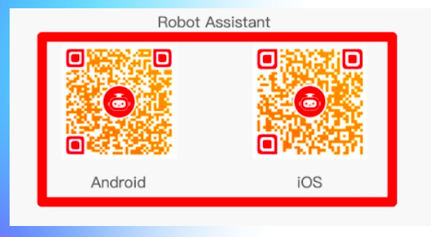
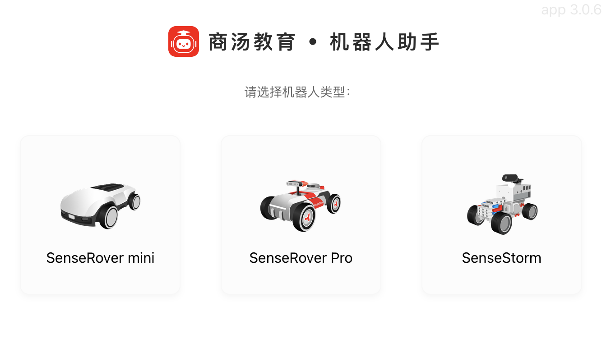
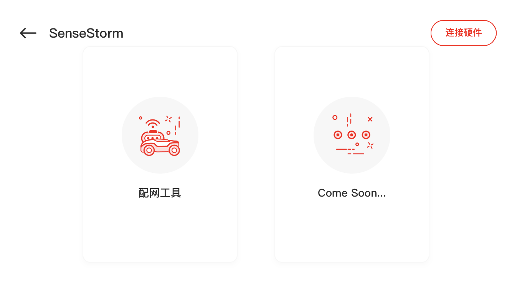
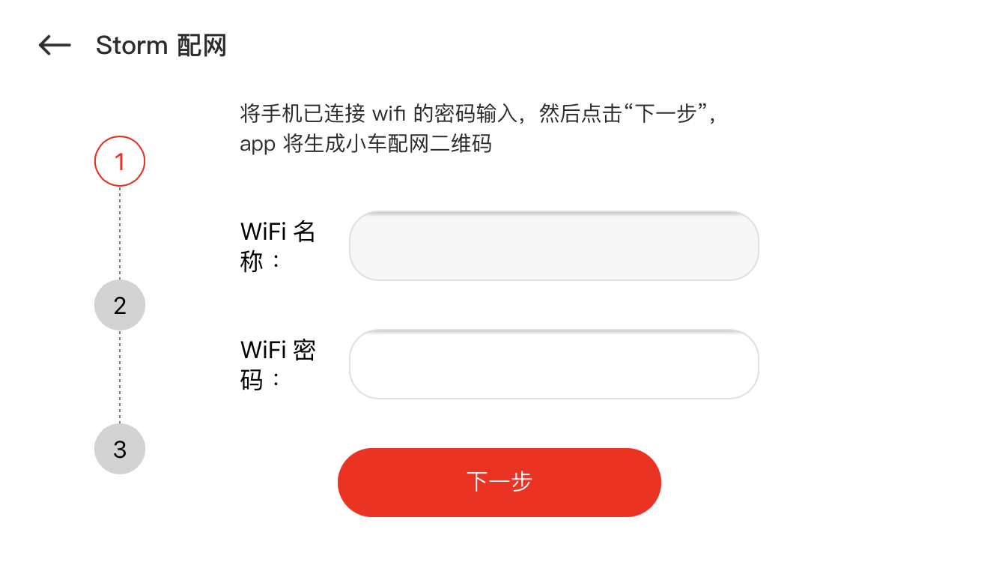
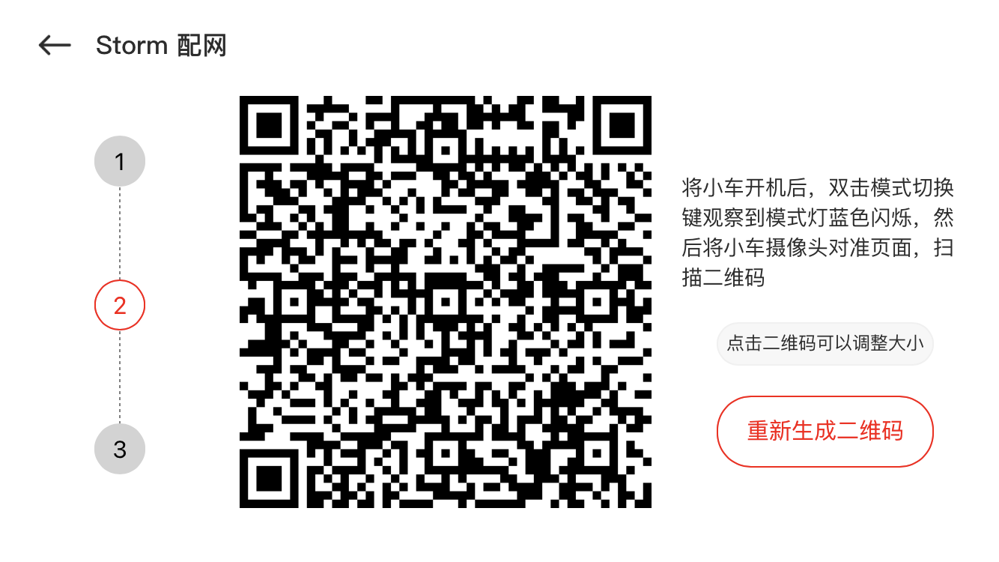
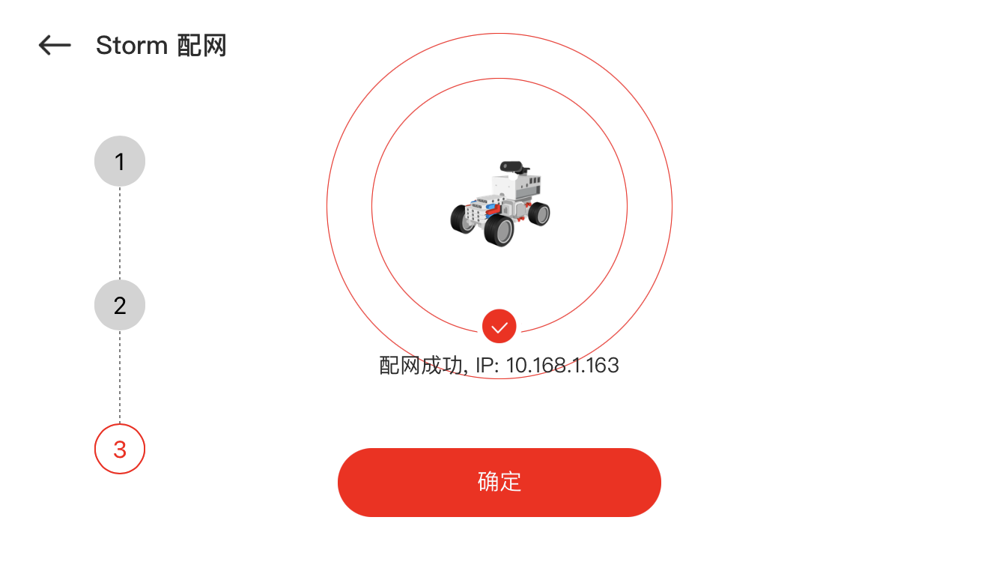

# Preparations

## Workshop notes download: [here](https://github.com/yzhang0301/codes/blob/master/EduHK_training_v1.pdf/)

## Connect to local WiFi network: SSID: IoT  PW: eduhk+IoT+2018

## Step 1: Download the "VNC Viewer" software on your laptop _(Optional)_
You could find the download link over [here](https://www.realvnc.com/en/connect/download/viewer/windows/)

Install the "VNC viewer" software on your laptop.

## Step 2: Download the "SenseTime Edu (PC Client)" software on your laptop
You could find the download link over [here](https://hk.study.sensetime.com/download/)

Install the "SenseTime Edu (PC Client)" software according to your operating system on your laptop (Windows or Mac OSX).

## Step 3: Download the SenseStorm Robot Assistant on your smartphone 
You could find the app by scanning the QR code:

## Step 4: Pair your SenseStorm with the App
1. Connect your smartphone to a local WiFi network.

2. Open the App and select the tab for SenseStorm:

3. Select the Network Configuration tool:

4. Make sure your phone is connected to a WiFi, and input the WiFi password:

5. Genarate a QR code and doulbe-click the mode-selection button of the SenseStorm, the camera of sensestorm should be ON, scan the QR code with the camera until the green light of the camera is OFF.

6. You are ready to go with this IP returned!

## Step 5: Control the SenseStorm over VNC _(Optional)_
1. Click to open the "VNC viewer" software on your laptop
1. Enter the IP in the top-up bar, typically as ***10.90.2.XXX***
2. username: pi
3. password: SenseStorm
